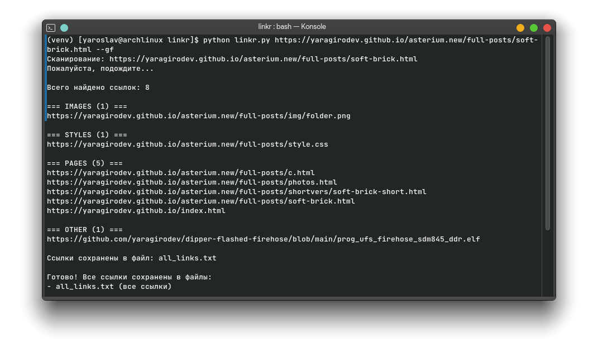

# linkr
Python script that extracts all links from a website and saves them to `.txt` files.  
Optionally, it can also download files from these links.



---

## Features
- Extracts all links from a given webpage.
- Saves links into `.txt` files automatically.

## Prefixes
- ```-gf``` - download files from site links to ``src`` folder.

---

## Usage

```bash
python linkr.py <url> [options]
